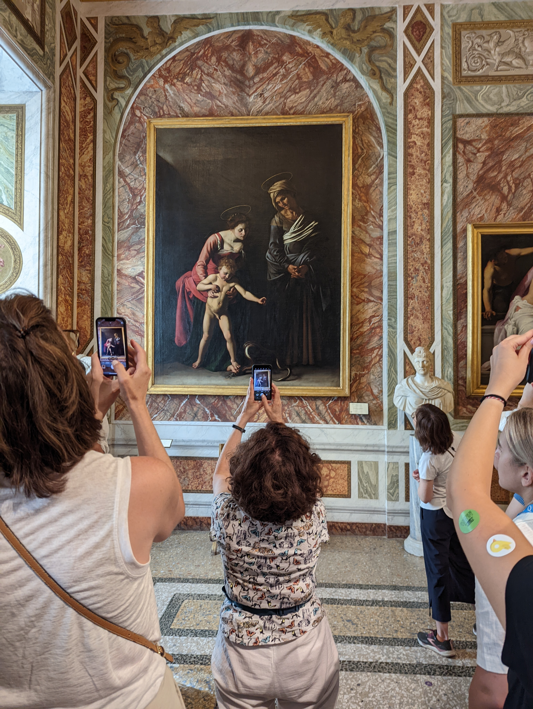

## Chiaroscuro{#chsc}

{size=75% .d-block .mx-auto}

We cannot talk about [Rembrandt's Light and the Darkness](../rembrandt/#disc) without delving into the Renaissance concept of *chiaroscuro* (it., *chiaro*: light + *scuro*: dark).

In September 2022, I was in Rome, and *Villa Borghese* was an obvious place to visit. Cardinal Scipione Borghese was a patron of Caravaggio, commissioning many works. In the museum, special attention was paid to Caravaggio's visual art; paintings were located in the very heart of the villa. Bright, open rooms were adorned with with intricate ceiling decor. Yet Caravaggio's canvasses were domineeringly arresting everyone in these breathy rooms; they were so dark; they were hypnotizing. They were consuming the audience with their gravity. Caravaggio's paintings were by far the darkest in the museum. Why?

High Renaissance artists such as Leonardo da Vinci (Mona Lisa) (1452-1519), Rafael (Cistine Chapel, [pictures weren't allowed]{.small-text}) (1483-1520), Caravaggio (1571-1610), [among many others]{.small-text}, introduced and believed into a brand new art concept: *chiaroscuro*. By the time our friend Rembrandt (1606-1669) appeared, ***chiaroscuro*** has set in and spread from Italia across Europe. After Caravaggio skillfully turnt it up to the extreme, the later artists resisted and their works mellowed Caravaggio's extreme chiaroscuro contrast out.

Art attempts to communicate ideas and intentions. I assume the reader has seen works from which they are unable to parse the artist's ***intent***; the reader may simply attribute their lack of understanding to the artist's abstract genius. But it is so because the artist lacks the precision to centralize their point. And if their point is too broad to be compellingly summarized or at least sketched on a finite canvas, I offer them the ending of Wittgenstein's *Tractatus*:

*Whereof one cannot speak, thereof one must be silent*.

**The ability to successfully dance between the light and the dark is probably one of the most consequential art abilities.** By controlling the tonality of color, you control the audience's perception of depth/distance. With an etching, the strength and the quantity of the lines carries a similar effect. **[You create 3D in a 2D world]{.underline}.** Here's where I hurriedly end my entry before it devolves into [longer writing](/essays/)'s thousands of words about the world's dimensionality, the darkness, the infinite, **the lack of true darkness in any black brushstroke, blotch, dip, or color -- a true silent art isn't a black canvas or an empty canvas, it is much scarier**; and how you humans can attempt to project back into a 5D world. (Space-Time is already 4D.)

::: {style="text-align: right;"}
-- dvp, July 2026 (2022)  
[Italia was cool.]{.small-text}
:::