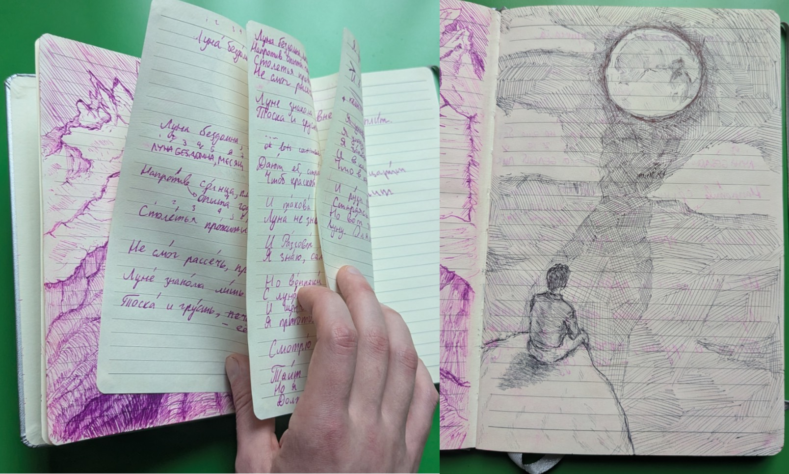

Friday-Sunday June 25-27, 2021. I was visiting a park around Wenatchee, WA. On Saturday, I woke up early and spent the daybreak by the water, writing.

I was 21, aimless. 2-3 months after writing *Luna*, I completely turned my life around personally and academically.

The poem helped me understand my (first) sudden severe disability -- my hearing loss.

{width=400px .d-block .mx-auto}

- [1. Russian original](#ru)
- [2. English translation](#en)
- [3. Discussion](#disc)

## Russian original {#ru}

::: {.small-text}
Луна, 2021

Луна бездомна, месяц стар, и этот белый лик,  
Напротив опыта годов, так тускло шепчет мне.  
Столетья прóжиты Луной, но диск, небесный бриг!-  
Не смог рассечь, проплыть сквозь шторм тревоги вне.  

Луне знакома лишь одна деталь из сцены сна:  
Тоска и грусть - её судьба, и вздохи красоты  
Дают ей странный взгляд на мир, и нету полотна,  
Чтоб краской жизни написать картину для Луны.  

И такова её судьба, плоды печальных лет -  
Луна не знает землю нашу - видит только сон.  
И разговор с Луной, увы, не даст тебе ответ,  
Я знаю - сам я говорил - и слышал эхом стон.  

Но вопреки советам я отправился опять  
С Луной бесшумно толковать и ночь ей отдавать;  
*И шепчет мне Луна всё то - что знаю я уже*,  
Я приютил её к себе, *забрал я Лунный Свет*.  

Смотрю Луне в глаза, как сон, и взгляда белизна  
Тоит загадочный циклон эмоций невпопад.  
Но я, безумец, знаю что - нужна ты мне одна,  
Должна ты мне Луна шептать, иначе прямо в ад...  

...я упаду, сквозь боль и безразличие ко всем,  
Я заперт в башне мысли ложной - там, где страх царит;  
И в камере, за прутьями обид, я болен тем -  
Что в коридоре Лунный Свет ласкает мрамор плит.  

И руки ревности отчаянно тянутся вмиг!  
Стараясь прикоснуться, тронуть очень нежно тень...  
Но вот тюремщик вышел и закрыл окно, извёрг  
Луну. Опять один, опять годами длится день.
:::

## English translation {#en}

Meanings of the last phrases each line map 100%, the whole text maps 99%; **meaning** over poetic translation.

::: {.small-text}
Luna, 2021 (2026)

Luna is homeless, the cresent is aging, and this white face,  
Contrary to the experience of the years, so dimly whispers to me.  
Centuries are lived by Luna, but the disc, the heavenly brig!-  
Couldn't cut through, sail through the storm of worries external.  

Luna knows only one detail from the scene of sleep:  
Toska[^1] and sadness are her fate, and sighs of beauty  
Give her a strange worldview, and there isn't a canvas,  
So to with the life's colors to paint a picture for the Moon.  

Such is her fate, the fruits of her sad years -  
Luna doesn't know our earth - she only sees a dream.  
And if you talk to Luna, you won't get an answer,  
I know, I talked myself, but heard an echoing moan.  

Against advice I took off to, once again,  
Converse with Luna and my night to her give;  
*And whispers to me Luna everything I know already*,  
I gave her shelter, *I took the Moonlight*.  

I look into Luna's eyes, like a dream, and the gaze's whiteness  
Contains a mysterious cyclone of emotions out of place.  
But I, a madman, know - I need you only,  
You must whisper to me, Luna, or straight to hell...  

...I'll fall, through pain and indifference to everyone,  
I'm locked into a false thought fortress. Where fear rules;  
And in the cell, behind the bars of insult, I'm sick that,  
That in the corridor - the Moonlight - caresses the marble plates.  

And hands of jealousy desperately reach out in an instant,  
Trying to briefly touch, hold very gently the shadow...  
But the jailman came out and closed the window, rejected  
The Moon. Again alone, for years lasts a day.  
:::

[^1]: **Toska** (Ru.) - I am keeping this word untranslated. Toska *can* be translated, BUT only in specific contexts that "color" Toska some specific way. I provide no context. Note on writing: "Toska and sadness" implies that Toska isn't sadness or a synonym of sadness. There are some amateur explanations such as Nabokov (who was restraintless -- a noble teen escaping Russia and attending Cambridge -- bashing other writers). Toska is simply the feeling of engrossed re-consideration of counterfactual simulation. Rumination, that can descend into perpetuity. Toska is a *what-if*. 

## Discussion - 2026 {#disc}

**A hopeless love poem. *What is not to love about [life]{.underline}?* Life, the poem bitterly states, is a moon seeing people dreaming. Never the sun, never the wakened people. That's what my life was, is, and will be.**  
Maybe for you it's different.

**My interpretation: It is about a suddenly onset restraint. How do you reconcile the beautiful, sonorous sun and the heavenly, quiet moon? Your life before and after? What changes isn't the *world*, it's *you*.** This isn't about the people who are born with sensory, physical, or neural differences thus not knowing the world without them. This isn't about a destabilizing world crisis. This isn't about the loss of a loved one. [But if such descriptions apply to you and you find meaning in the poem, I offer the text in kindness and [partial]{.underline} understanding.]{.small-text} **This is about a sudden, deeply intrinsic crisis. The thunderous bolt of lightning that travels through *you*, not *your world*.** Think Spinoza's dauntingly controlled excommunication, Nietzsche's declining neurological condition.

Original is seven quatrains in iambic heptameter: ABAB CDCD EFEF xxxx GHGH IJIJ KLKL. The middle stanza was accidental and has no rhyme, but I kinda like it the most. The stanza I have my index finger on in my notebook picture. The *I took the Moonlight* one.

When I say rhymes, I mean **rhymes**. The very **first stanza**'s A-rhyme sets a tone: BIE-*leey* LIKh / nye-BIE-*sneey* BRIKgh (white face / heavenly brig). Or for example, **stanza 2** has SNAh / pawlawtNAh (decl. sleep dream, canvas) and **stanza 3** follows with a mid-line sood'BAh (fate). Similarly, **stanza 3** has LYET / otVYET (years, answer) and **stanza 4** immediately mid-lines soVYETam, which is a declensed soVYET (advice) -- everyone on Earth knows this word, but most English speakers stress it wrong.

Appreciated flows thus exist throughout the original text.

::: {style="text-align: right;"}
— dvp, 2026 (2021)
:::