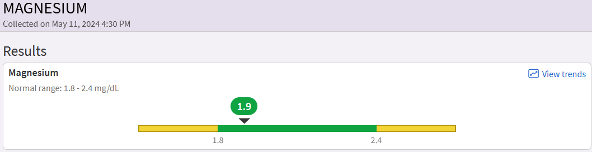
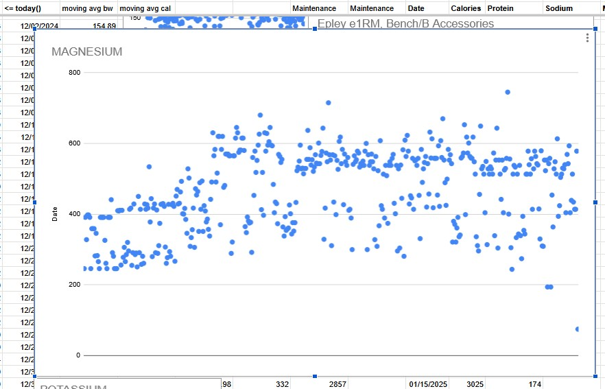
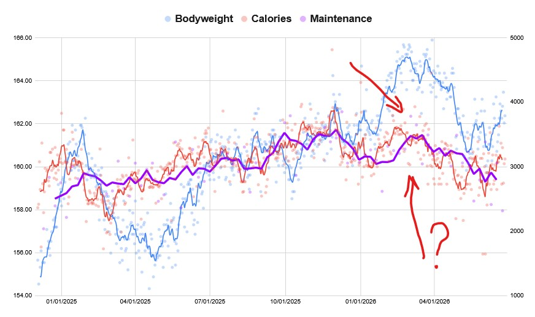

1. [Magnesium](mg) = helps with fatigue and sleep.  
2. [Creatine](cr) = helps with brain fog. [(brain fog isn't fatigue)]{.small-text}  
3. [Omega-3's DHA](o3) = a myelination component.  

These are so, so important. I will discuss each, 1239 words total.  

I annoyingly stress, I value natural intake over standalone supplementation. **READ AT THE BOTTOM.**

### Magnesium {#mg}

I have more than a hundred MyChart test results ranging from thorough brain MRIs and spine CTs, to routine daily measurements.

What was the very first test result? Before any vitals, before anything else?

{fig-align="center" width="60%"}

Both were in normal range because the Airlift Northwest EMS infused me with electrolyte-containing fluids. But you can see that it is already exiting the normal range. My organism was running through magnesium. Why?

**Magnesium weakly controls Glutamate, the brain's primary excitatory neurotransmitter, through the NMDA receptor.** [(What else acts on NMDA? Amantadine, the obscure old anti-Parkinson's medication I was prescribed by the trauma center.)]{.small-text}

<a href="https://pmc.ncbi.nlm.nih.gov/articles/PMC4586582/" target="_blank"><em>Magnesium in Prevention and Therapy</em></a>

Around 50% of US adults have inadequate Magnesium intake (**which to me is around 400 mg a day**). Half of America is too excited, sleeps too little, and has brain function in disequilibrium. You need more magnesium to facilitate the patching of your brain, whether actively micromanaging, or passively assisting sleep and glymphatic entrance.

Some Magnesium sources:  
[Vegan]{.review-yeah}: leafy greens, nuts, whole grains, soy, many fruits, COCOA.  
[Else]{.review-hmm}: animal products (dairy, meat), COCOA.

{width=300px .d-block .mx-auto}

**Note:**  
- If supplementing, I think L-Threonate is marginally better, but WAY more expensive. Experiment to determine if the "better" outweighs its cost. (I doubt.)  
- I warn you about supplement scams at the bottom.  
- !!!!! I repeat, read the bottom. !!!!!

### Creatine {#cr}

Now, this is a bit harder to get without supplementation. Creatine is nothing extraordinary -- trace amounts are contained in red meat -- but that's it, trace amounts. You need to eat a few pounds of meat a day to get enough creatine for your cognitively impaired brain.

And it primarily helps cognitively. Let's motivate creatine and ***"brain fog"***:

- If we need energy for a quick task, we use the Adenosine Triphosphate-PhosphoCREATINE (ATP-PCr) system.  
- If we need energy for a slow task, we use carbs (glycose) or fats (ketones). [Like how my organism ran through carbs and started ketone use while I laid in the mountains unattended.]{.small-text}  
- We always need energy... We use something called **oxygen** and Krebs Cycle to give background energy.  

People associate ATP-PCr with explosive weightlifting moves, but we do quick tasks everywhere in our lives. Some mental approximations, modestly noticeable physical reactions, reactions in general.

**Brain fog is not fatigue. Brain Fog is the lack of a specific energy, causing a *slowdown* in your reaction.** Your brain feels heavier, stretched thin, and the ability to make quick inferences drops. You feel less clarity. Things are less clear, hence the name "brain FOG".

I supplement 5g of Creatine powder daily during breakfast; I just plop it into my morning glass of orange juice. [OJ has magnesium and potassium.]{.small-text}

**Note:**  
- I just grab random unflavored Creatine Monohydrate off Amazon.  
- There's flavored too. There are pills too. You can use any liquid for the powder.  
- I take it right after waking up during my first meal.  
- Some survivor's brains just react badly. See if building up over a few weeks with a smaller dosage works.

### Decosahexaenoic Acid (Omega-3) {#o3}

::: {.callout-tip collapse="false"}
## I motivate this segment:

*When I was preparing for my March 2026 USPA Powerlifting meet, I was aggressively ramping up my calories knowing I have the luxury of a "24 hour weigh-in" where I can bounce back from bodyweight manipulation. However, I also started taking an Omega-3 pill or two or three a day. I do not eat much fish. What happened? The graph below tells you.*
:::

{width=350px .d-block .mx-auto}

This is *ceteris paribus*. No other changes (e.g., exercise time, step count, sleep, time/condition of weigh-in) happened.

Well, regarding sleep, one thing changed:

After two weeks of purposeful Omega-3 supplementation, **dreaming** returned.

I still do not remember most of my dreams, but I can feel I have them; and I can jovially recall them dissipating when I wake up.

This is in direct contrast of how for nearly two years after my DAI 3, I was "turning off" rather than "sleeping". I'd close my eyes and be awake near instantly.

Primary suspect: Decosahexaenoic Acid (DHA) of the Omega-3 Fatty Acids. DHA is a component of a myelin sheath, which wraps axons/nerves and allows smooth neuronal communication. The degeneration of myelin is what Multiple Sclerosis is. [I'm sure folks who have it eyeroll at my explaining DHA importance here.]{.small-text} Additional DHA uses could be fixes in the Vagus Nerve and Pons infrastructures.

By using my daily data and holding the *ceteris paribus* assumption true, you can approximate the volume of nerve fixes that happened inside my brain. I started taking 287-860 mg of DHA a day (let's say 400 mg DHA average), and my body started going through an enormous amount of calories. [Amazon order was February 21, 2026. Here are 11-day maintenance calculations for March 16 to 26, 2026: 3657, 3784, 3724, 3862, 3847, 3790, 3777, 3575, 3647, 3778, 3606.]{.small-text} I had to consume 3700 calories a day just to remain the same bodyweight. This is 500 more than what I usually needed at that activity level.

I didn't do that well in the powerlifting competition (140 kg squat, 195 kg deadlift in the 75 kg class) as I was energy-hungry, but my dreaming returned. And I'm sure other cognitive improvements happened.

**Note:**  
- Take Omega-3 with a meal containing fat (helps absorption).  
- Fish naturally contain Omega-3; I almost never eat fish though.  
- I warn you about supplement scams at the bottom.  

### Natural Intake or Supplements, Supplement Math

There are two reasons why I believe natural intake is superior.

First, you should always make sure to maximize the usefulness of your calorie consumption. Abdomen and brain are connected by the tenth cranial nerve, the Vagus Nerve. We are genetically predisposed for tens of thousands of years to react to nutrients directly in the food we consume. Food biochemical makeup makes it easier for our organism to break them down and begin transporting them to the brain.

Second, you lull your mind into a toxic mindset of simplifying and delegating your organism's problems to some exogenous fix. You also cease to understand supplement effectiveness. You just buy it because "people said it's good". You risk overspending, misdiagnosing the problem, or stacking too many supplements (I channel my economics background to present a concept: Diminishing Marginal Utility). We only have so many bio-chemo-electrical resources in the brain, and taking 1000 supplements stretches the resources to process the supplements too thin.

**Lastly, I will warn you about SUPPLEMENT SCAMS:**

"Serving size" is rarely one physical unit (e.g., capsule). Supplement companies use 100500 other dirty tricks to influence you into a purchase.

We need 400mg Magnesium daily. Yesterday I had 578mg of Elemental Magnesium (Mostly Quinoa and Tofu). Week before was 593, 404, 439, 513, 434, 414, 414.

Let's open Amazon and search for "Magnesium L-Threonate". The "Overall Pick" is ["Magnesium L Threonate Capsules, High Absorption Generic Supplement, Most Bioavailable Form, 2,000 mg, 100 Capsules]{.small-text}. Good, right? **Or is it?**

First, 2000 mg is the capsule weight, not the amount of elemental magnesium, which is 144 mg per serving. What's a serving? One serving is *four capsules*. Meaning 1 capsule is actually 36 mg of Magnesium, and if you rely on supplementation, you need to *at least* take 8 capsules a day to try and get "400 mg" given L-Threonate crosses the Blood-Brain Barrier better. (Their "Suggested Use" is 4 capsules a day.)

::: {style="text-align: right;"}
— dvp, 2026
[What do I know, I merely returned to 400-level math just 4 months after a DAI 3.]{.small-text}
:::