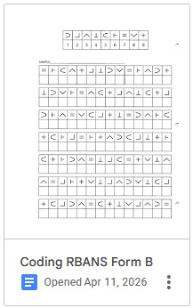

**We are neuropsychologists now.** I have had my share of "daisy, velvet..." and "continuously subtract 7 from 100" in the hospital, but here are three concrete standalone results:

**2024:**  
I fell 40 ft and suffered a DAI 3 on May 10. I was found and transported on May 11. I was already discharged June 6. I took a serious but less time-sensitive battery (WAIS-IV and others) August 7. I took a time-sensitive RBANS battery September 16. I repeated a different version of the RBANS battery October 29.

### WAIS-IV

*Wechsler Adult Intelligence Scale* (WAIS) is a comprehensive cognition battery. However, it may not accurately reveal DAI "latency" problems. WAIS moreso measured the brain's current ability to recall deeply internalized intellect.

Administered in Harborview Medical Center 90 days after a Grade 3 DAI, a WAIS-IV test, as well as a combination of 11 other tests (2 hour battery, 20 minute break, 1.5 hour battery), yielded:

**Verbal Comprehension** = Very Superior  
**Perceptual Reasoning** = High Average  
**Working Memory** = [*? wording suggests Average ?*]{.small-text}  
**Processing Speed** = Borderline

I suppose I could request precise results (I have those for the RBANS but not here).

Here's an interesting tidbit of three questions in a sequence during VCI discussions: *Who is Sacagawea?* (correct answer), *Who wrote Sherlock Holmes?* (correct answer), but next I grimaced in contemplation when asked *Who wrote Alice in Wonderland?*. Why? When I was told the correct answer, I realized what happened and explained myself to the proctor: *Lewis Caroll* (Alice in Wonderland) sounds awfully similar to *Lewis and Clark* (Sacagawea). **The brain defaults to heuristic frameworks and associations while fragmented, and those are seemingly easily entrenched.**

WAIS-IV is an outstanding, thorough battery that tests the *Default Mode Network* moreso than the *Salience Network* and the *Central Executive Network*. Meaning, there are less incentives to be stringent about the speed of how quickly the DMN pondering transitions to the CEN output; it's the sheer volume of the testing material that psychologically and neurologically daunts the test-taker; not the quick switching between one category to another. Just the fact that there is a break in-between, is telling (*and I remember urging the Harborview staff to resume the testing and I don't need the full 30 minutes -- they did -- "I'm ok!"*). Not so OK -- throughout the test, I had a genuine concern of "losing my thought" --- some speed was needed lest "thought dissipation" occurs. I'd do qualitatively better now.

::: {.callout-tip collapse="false"}
## Academic Functioning:

"Word recognition skills, an aspect of reading, presented in English fell within the average range. Written spelling skills fell in the very superior range and performance on a written test of mathematical problems fell within the superior range." [-- i.e., math was timed which interfered with my dopaminergic situation]{.small-text}.
:::

### RBANS

Twice administered in EvergreenHealth Medical Center 129 and 172 days after a Grade 3 DAI, the *Repeatable Battery for the Assessment of the Neuropsychological Status* (RBANS) battery had more stringent time-constraints, but was shorter (30-45 minutes total).

It has 12 short assignments in quick succession. It is designed to test five categories: Immediate Memory, Visuospatial/Constructional, Language, Attention, Delayed Memory.

**There are three versions of the battery** -- designed for re-administering -- to see changes in cognition. Meaning, if the *exact same* test gets re-administered, we are unsure if the change in the score came from a change in cognition, or if the applicant is able to recall the previous test (thereby the score improving), or if the applicant was confused by the previous test (thereby the score decreasing).

First one:

| Category | Percentile | Severity |
| :--- | :---: | :--- |
| Immediate Memory | 16 | Average |
| Language | 4 | Mild to Moderate |
| Visuospatial/Constructional | 30 | Average |
| Delayed Memory | 9 | Low Average |
| Attention | 3 | Mild to Moderate |

: The comparison is with 20-39 y.o. Healthy Controls.

Then another one 43 days later:

| Category | Percentile | Severity |
| :--- | :---: | :--- |
| Immediate Memory | 91 (+75) | Superior |
| Language | 79 (+75) | Average |
| Visuospatial/Constructional | 50 (+20) | Average |
| Delayed Memory | 42 (+33) | Average |
| Attention | 12 (+9) | Low Average |

: Percentile improvement in 43 days; was already attending university.

*Language* subtest *Semantic Fluency* (administered as the 6th battery into the test) had great improvement. Standard deviation improved by +4.1, climbing from -2.6 to 1.5.

**Intuition:** the DMN->SN->CEN transition speed of naming different words sped up.

*Attention* subtest *Coding* (chronologically 8th) was the assignment keeping the "Attention" percentile lowest in both batteries. Standard deviation moved by +1.4, from -2.6 to -1.2.

**Intuition:** I'd guess that coding is the most interregional and temporally-constrained task requiring rapid switching on case-by-case basis. Marginal slowdowns could be even attributed to damage to my cranial nerves responsible for vision, as that is something you need to coordinate in coding between finding all those symbols...

::: {.callout-tip collapse="false"}
## What is "Coding"?

You see a symbol, pattern match it to a reference and note the corresponding number, and then write that number down. **You have 90 seconds.**

{width=120px .d-block .mx-auto}
:::

As you can see, I randomly repeated it in April 2026, nearly 2 years after my trauma, hoping for some improvement. I did some cognitive work prior, to simulate the fact that the Coding task is administered 8th in the battery.

*Attention - Coding:* 54 symbols; 20-39 y.o.; $\mu = 56.5$, $\sigma=8.8$. SD: +0.9, from -1.2 to -0.3.

Modest improvement, this remains a difficult subtest requiring rapid coordination and as my *Essay 1* tacitly digressed, "I am not instantaneous in my *GO!* signals."

Though I started being able to memorize the symbols by the end. I will repeat the form C of this subtest in a couple of years.

::: {style="text-align: right;"}
— dvp, 2026  
[Overall I'm content. VCI Very Superior is supposed to be cool.]{.small-text}
:::