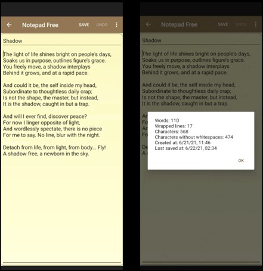

Monday June 21, 2021. This Shakespearean Sonnet came 5 days before I wrote [*Luna*](../work1/). You can see how "shadow", "sky", "light" -- the entire poem -- was motivating Luna.

- [1. Shadow](#shadow)
- [2. Discussion](#disc)

## Shadow {#shadow}

::: {.small-text}
The light of life shines bright on people's days,  
Soaks us in purpose, outlines figure's grace.  
You freely move, a *shadow* interplays  
Behind it grows, and at a rapid pace.  

And could it be, the self inside my head,  
Subordinate to thoughtless daily crap;  
Is not the shape, the master, but instead,  
It is the *shadow*, caught in but a trap.  

And will I ever find, discover peace?  
For now I linger opposite of light,  
And wordlessly spectate, there is no piece...  
...for me to say. No line, blur with the night.  

Detach from life, from light, from body... Fly!  
A *shadow* free, a newborn in the sky.
:::

{width=200px .d-block .mx-auto}

## Discussion {#disc}

A degree of appreciated abstraction is a requisite to quickly reorient yourself to the world's overwhelming projection. I got an opportunity to "put my money where my mouth is" 1000 days after writing *Shadow* and *Luna*. I spent a whole day being my own tether in the mountains. Entirely unsupported, decorticate posturing, bombarded by a solar storm. ([Here](/disabilities/#polytrauma).) This level of traumatic impact and neglect should be fatal. Instead, I was good enough to get sent home after 27 days in the trauma center. I stress, out of already lucky people who do get to awaken from a DAI 3, the lucky average does so in 2 months.

Here, I voiced my problem and the associated uncertainty. 5 days later, I attempted to resolve it, having no confidence in English and resorting to native Russian.

This is a broad and heavy poem. I leave its interpretation to the reader; *Luna*, essentially, is my interpretation of it.

I was 21.
