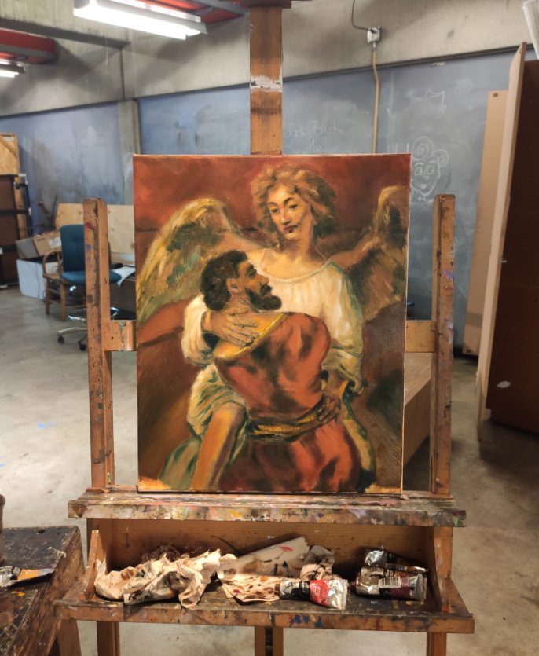
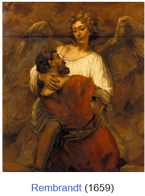
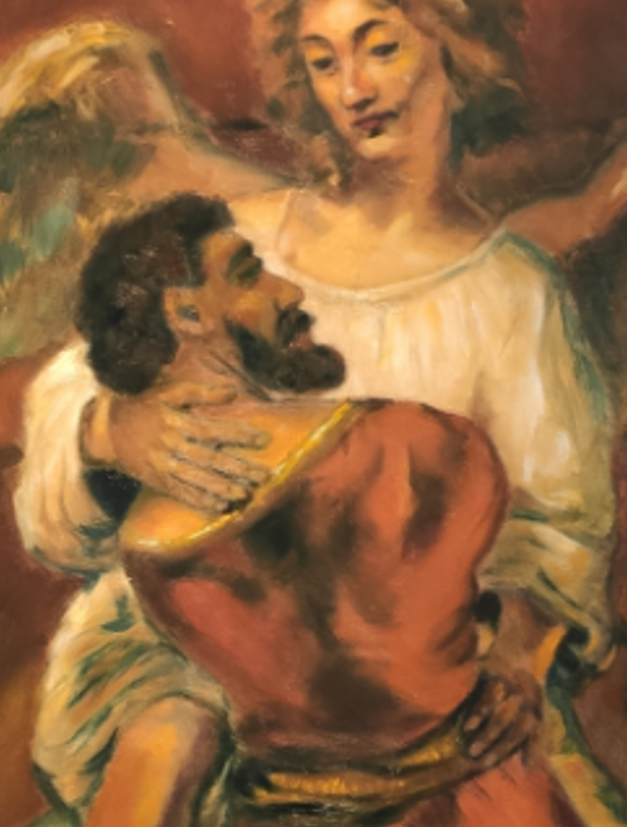

November-December 2021, an oil painting course in community college I was taking for fun had a journal of masters' works, and I chose to copy Rembrandt's 1659 *Jacob Wrestling with the Angel*.

- [1. Jacob Wrestling with the Angel](#rembrandt)
- [2. Detail](#detail)
- [3. Discussion](#disc)

## Jacob Wrestling with the Angel{#rembrandt}

{width=auto .d-block .mx-auto}

I am a bit trained. I passed entrance examinations into my local Siberian Детская Художественная Школа in late 2000s, and was trained in composition, art history, and several mediums including digital. (In 2012 I left for America before we started oil.) Previously, I also was a member of a children's cartoon studio. We did alright, I was a part of a 3-student team that traveled from Siberia to a festival in Moscow (our cartoon won an air con unit ☺) when I was 9.

{width=auto .d-block .mx-auto}

## Detail{#detail}

{width=auto .d-block .mx-auto}

I tried to mimic everything, including the original's fold (?) in the fabric leaving a dark impression.

I paid special attention to the Angel's hands, as when I was looking over the original work, I found that to be the most detailed part. Hands (and eyes) communicate what a person is. And unlike small eyes, hands offer many bigger opportunities to express intention. I thought the left hand was gently pushing away, and the right was flat out warmly embracing Jacob, contrary to the word "wrestling". 

Looking over Rembrandt I thought Angel's garbs were soaked in light. I thought Jacob was intentionally painted poorly, and perhaps I overemphasized that. My Jacob was a mere sketch. I can tell that his back should be a fair bit a bit different --- I have too much darkness adding depth, when Rembrandt's more monotone and that adds width rather than thickness. For example.

I also was constrained by time as this was technically a community college assignment; everyone picked a random work from a broad collection to copy.

I suppose as with any intentional copy, you exaggerate. I also simply cannot have as much finesse working on a 50x40 cm canvas to fully copy a 137x116 cm painting. (I'm also not as good as Rembrandt.)

## Discussion{#disc}

([You can kind of tell how much my brain was pre-neuroplasticized in preparation for trauma. FWIW, I haven't seriously painted ONCE since. I am still young and uninspired though. I am only 2 years out of my injury. I'm hopeful I'll dabble in visual art sometime again.]{.small-text})

The most important part of this painting, or any religious painting for that matter, is the highlight and the shadow. The light and the darkness.

Rembrandt understood that, look at how his work interweaves light. Look at how there is just a little strip of light on the Angel's right hand. Where Jacob is not covering the Angel, light from the center of the angel radiates. This is an important part of a religious artwork: the "holy" radiate light. They are a light source. By comparison, you can find Jacob be dimmer, duller, darker. The work overwhelms with changes in light and darkness.

Yours truly of course noticed this, and paid special attention to the interplay of the light and the darkness. You can see how I enjoy the idea of light originating from the Angel's heart and the robe having numerous highlights. I also used shadows to create negative brightness.

With 50x40 cm of space versus Rembrandt's 137x116 cm, I couldn't even begin to attempt to add some white to the Angel's eyes (even Rembrandt himself mostly adds dark irises). **In fact, I will comment as a non-religious person:** I think if some supernaturally everpresent concept (anything, Christianity, Islam, Judaism, Spirituality, etc.) does exist, then it's about the *darkness* moreso than the light. Even when you squint at the Rembrandt's Angel (who is (?) supposed to be God in disguise in the story), you see that the eyes have a darkness we mortals simply cannot begin to understand. The heart and the skin of the being radiate light, but the eyes are a total abyss.

**The ability to successfully dance between the light and the dark is probably one of the most consequential art abilities.** By controlling the tonality of color, you control the audience's perception of depth/distance. **[You create 3D in a 2D world]{.underline}.** Here's where I hurriedly end my Creative's Work 3 entry before it devolves into [longer writing](/essays/)'s thousands of words about the world's dimensionality, the darkness, the infinite, and how you humans can attempt to project back into a 5D world. (Space-Time is already 4D.)

::: {style="text-align: right;"}
-- dvp, July 2026 (2021)  
[Here's to art.]{.small-text}
:::