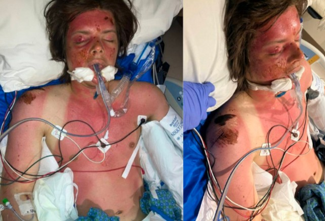
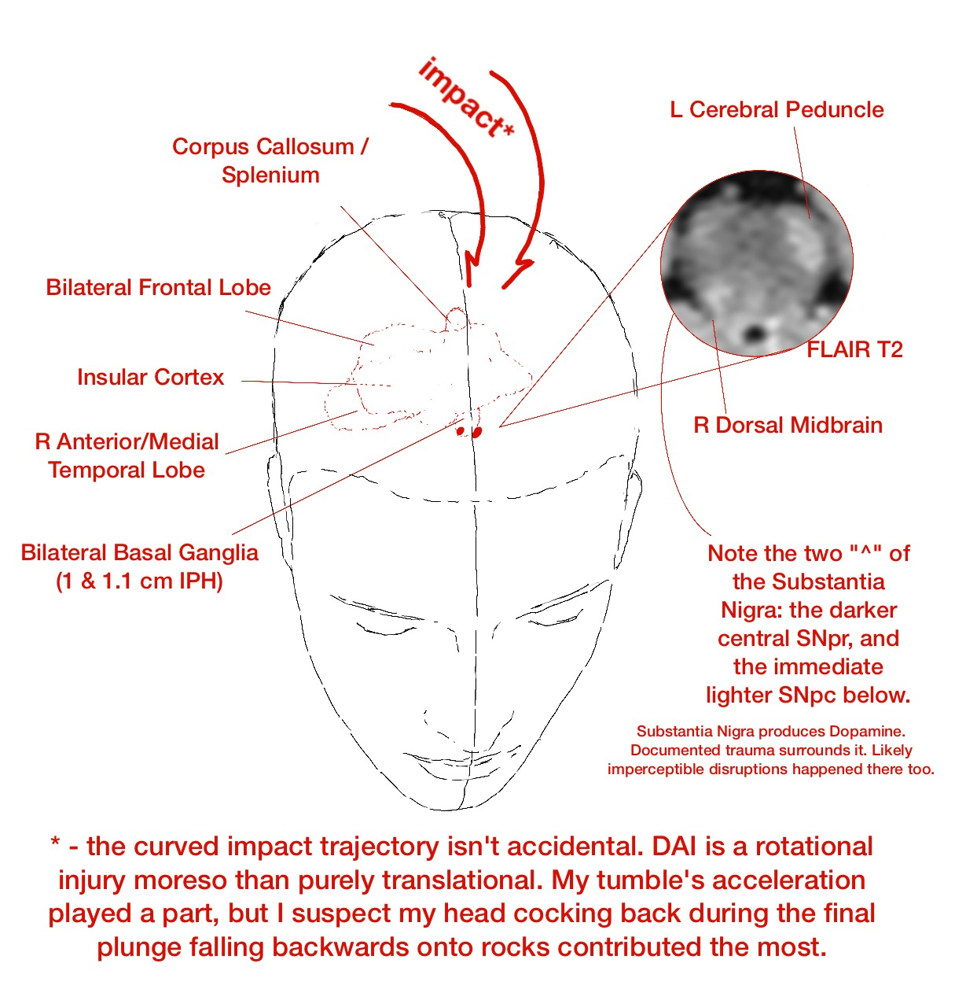

My life has been permanently modified by my hearing loss at 10 and my TBI at 24.

- [1. Sudden Bilateral SNHL](#snhl)
- [2. Critical Polytrauma - Difficult Read (image spoilered)](#polytrauma)
- [3. Living with a Grade 3 DAI](#dai)

## Sudden Bilateral SNHL {#snhl}

November 2009, aged 10 in Siberia, I went to bed hearing, and woke up: the bedsheets don’t rustle, the birds don’t chirp outside, or my scared howl for my parents doesn’t register. I suffered an unexplained 70-80 dB hearing loss in both ears (I was a soloist in a choir and was in a music school studying fortepiano). I spent more than a week living in a hospital and an explanation wasn’t found. Auditory Clinics had nothing. Just, Sudden Sensorineural Hearing Loss of 70-80 dB, worst at the speech frequencies. My family, entirely hearing, quickly got me a pair of well-made Phonaks. I didn’t learn RSL (or ASL) and struggled on.

Hearing is a vital part of communication, education, and overall development. I went from winning every early olympiad (Russian, English, Mathematics, Literature) to struggling with assignments. My mind was pre-occupied with my disability. After 6th grade, while I passed entry testing for a truly selective summer preparatory program in ФМШ при СУНЦ НГУ to prepare for olympiad math, programming, and next year enrollment into ФМШ; I couldn’t focus and wasn’t able to finish it. Just two months later, my family of 5 moved from Siberia to Seattle.

I was given the choice to stay behind, as I was already somewhat old (13). I moved. My English vocabulary was great having spent 7 years taking private English lessons. But it’s not easy to be a teenager where you cannot audibly *understand* other kids or teachers. Interpersonal communication is important for human beings, and that was lacking. While I easily passed Written English tests (or less stellarly, Speaking English tests) – I could not, for the life of me, pass Listening English tests. The school(s) made no circumstantial adjustments and I was stuck in an English Language Learners class for years. How do you develop interests and hobbies if you cannot converse and learn from others? Teenagers are ruthless – whether mockery, dismissal, or overbearing pity. None are great for a curious, developing mind.

So I barely graduated from High School, got into a satellite campus of University of Washington, and promptly dropped out within the first quarter. I spent three years (coinciding with the pandemic) not doing much, just some nighttime labor (*even at the entry level, a customer-facing position was nearly impossible, managerial duties a pipe dream*). In September 2021, I returned to a Community College. My grades were high, I retook the SAT and got a 1520/1600 compared to the 1390 I got 4 years ago in HS (improvement driven by English); within a year I was directly transferring into the Economics program of University of Washington, Seattle.

Still, the problem of *hearing* remained and was much more accentuated in a huge city university compared to a small community college. Abstractly, **communication breeds motivation**. In life, if you aren’t motivated to succeed, you get left behind. And every passing conversation, every auditory stimuli, every engaged tone, nevermind cooperative studying – they subtly nudge you to be better. Podcasts and audio recordings; every remark that was judged to not be important in the slides but said audibly – what a joke. I lacked this motivation. While I discovered and was attending PhD seminars in Micro, Macro, Development Economics and Econometrics, I could not find motivation to pass a simple introductory Real Analysis course. (Math benefits from and encourages collaboration.)

So, my (and any HoH, d, D person) [extrinsic]{.underline} motivation is constrained via the auditory dimension. However, a constrained person might have more avenues for [intrinsic]{.underline} motivation:

## Critical Polytrauma - Difficult Read (image spoilered) {#polytrauma}

May 2024, I was 24. I went on a Mt. Rainier National Park hike by myself, planning to hike for a few hours and return to my Russian-speaking community theatre rehearsal in the evening – which I never did – alerting my family. I have a four-week memory gap: one week before is very iffy and three weeks after are completely blank (even while I was semi-conscious).

Matching the last phone photo and ranger reports, both featuring a unique landmark: Friday (5/10), 12:30 PM I tumbled 40 ft down a riverbank, offtrail, headfirst on rocks. Imprints of extremities were left on the riverbank. Saturday (5/11), 12:30 PM a rescue park ranger stumbled across my body. The weather was great, it was sunny (ok, it was a solar storm), and I was shirtless. Swollen, with 2nd-degree sunburns, all while “decorticate posturing” (arms flexioned towards chest, legs straight - a signal of deep disruption in brain-body communication). My right hearing aid broke on impact. **I was alive**.

The EMS were called, a helicopter arrived and hovered; I was intubated. My Glasgow Coma Scale (3-15) was 5 (measures Eye, Verbal, Motor response ability E1V2M2); L pupil was unreactive to light. Saturday, 4:26 PM reports started at Harborview Medical Center in Seattle. Meaning I spent the first 24 hours alone, then 4 more hours with very limited care in the wild.

So, my lung was lacerated on impact and I developed Pneumonia. My muscles broke down and I had Rhabdomyolisis. I aggressively consumed myself for energy and had Starvation Ketoacidosis. Beyond these systemic secondary insults developed while I “enjoyed” the mountains, my Right palm was profoundly fractured breaking the fall, my Right Lumbar was fractured, my face suffered some closed fractures, and my Right shoulder ground against rocks and had soft tissue damage; some scarring exists in multiple locations. This doesn’t discuss the secondary brain injury metabolic cascade.

::: {.callout-tip collapse="true"}
## Spoiler: 67 hours into hospitalization, 95 hours after trauma

{fig-align="center" width="75%"}
:::

The mechanical closed impact landed front-center (biasing the right side) near the top of my head and traveled deep into my brain; the documented micro-shearing reached the brainstem. This is called a Grade 3 Diffuse Axonal Injury. I provide more details in the next section, Living with a Grade 3 DAI, as reported by imaging.

Camino was removed 25 hours into stay, extubated 71 hours in (GCS 13 already), was conscious and stable enough to be transferred to Acute Care on day 4, was admitted into Rehab on day 20, and was sent home on day 27… This timeline doesn’t count the first \~24 hours in the elements and is \*highly, highly, highly, highly, highly, highly, highly, highly improbable\*. I am not exaggerating. Also, I am fortunate my polytrauma wasn’t in any serious way open.

## Living with a Grade 3 DAI {#dai}

Much can be reducible in human experience.

(Much does not imply *all*. Abstract ideas such as *will*, *consciousness*, *emotion* feel incomplete.)

\[Note: I’m OK, I returned to UW-Seattle 4 months after, graduated *without delays* 13 months after, deadlifted 180 kg in competition 14 months after a DAI 3. But it wasn’t trivial.\]\
\
Walking isn’t trivial; talking isn’t trivial; object permanence isn’t trivial. All three in conjunction with each other are a HUGE task: having a walk with someone, looking sideways at them and conversing *on the move*, while being confident in your awareness of/response to the road features. It’s not trivial to remember your mother sitting across the table while you are eating.

*The previous paragraph is broadly "woah..." understood by a “regular” person. TBIs are unique in pathology AND in rehabilitation/lack of. Survivors present with numerous other nebulous and quirky challenges: sensory sensitivity, temporal attentiveness, aphasia, amnesia, motor procedures, localized and general fatigue are some other points frequently made.*

I haven’t even begun discussing the abstract stuff: ability to predict, ability to empathize, ability to detect lies, and to lie yourself. All four originate from and can be trained by the same idea: perhaps I should publish some intuitions on that.

Working memory capacity, internalization of experiences, memory sequencing, broader emotional regulation, and contextualization of memories and speech.

{fig-align="center" width="75%"}

Damage was done to my dopaminergic structures – responsible for rewards (learning) and for Salience – a big puzzle is how to prompt myself to act in lieu of proper dopamine utilization. How do I prompt myself to form memories? How do I prompt action? How do I do the procedure of action? I seem to stare without initiating a verbalized thought, and then I seem to stare without transferring the thought into writing, into speech, into movement. **How do you improve here?**

When you turn off and stop (a healthy reader is unlikely to understand this), **are you conscious? How do you reduce the incidence?**

Summarily, **what do you do when your actions lack [velocity]{.underline}?**

These are some philosophical, physical, and cognitive questions I grapple with.

Clearly grapple successfully, but these are some hard questions. It’s not trivial to entertain them daily.

**Presuming the reader is interested in some sort of “improvement”: ponder which of your concrete experiences are reducible, infer the causal steps needed, and proceduralize them to the best of your ability.**

I pray (*and I’m not even religious!*) such a neurological trauma does NOT happen to you or to the people you care about. It is a devastating condition and I urge you to not use this vulnerable but overall very positive first-person discussion to downplay DAI or TBIs in general.

Thank you for visiting my site.
