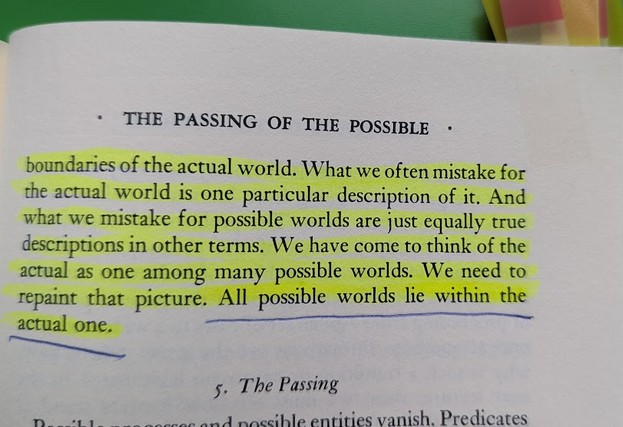
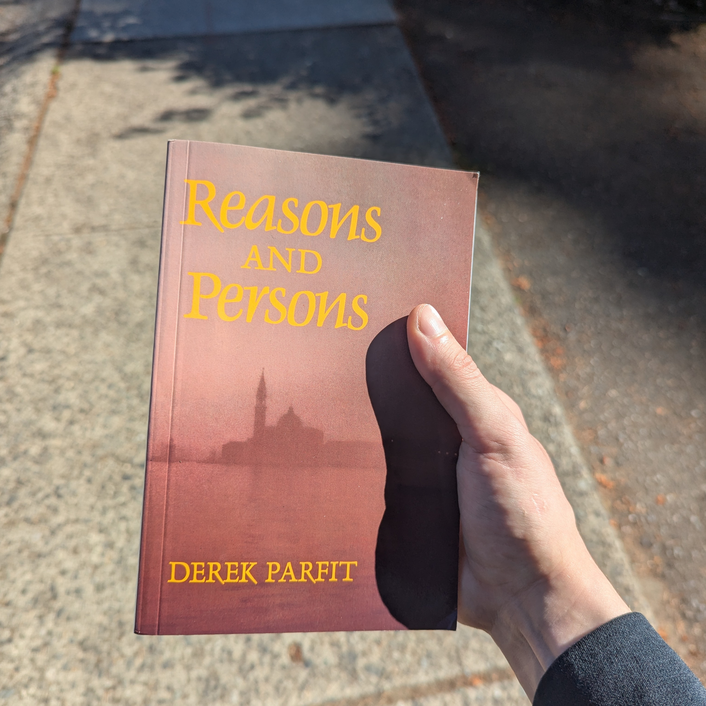

[Reality is a jenga tower of induction. It collapsed. Can you rebuild it?]{.small-text}

**Suggested:**  
*Fact, Fiction, and Forecast, 4th Ed.* --- Nelson Goodman  
*What Is It Like to Be a Bat?* --- Thomas Nagel

**Acknowledged:**  
*be deeply unconscious in the NeuroICU and develop psychosis after*

- [Induction: through early days](#motivating)
- [(spoilered) Metaphysical fears: contemplating "escaping" myself](#lesson)
- [Gradient of reality: some conclusions](#concluding)

### Induction: through early days {#motivating}

My day-to-day memory started to return 17 days in, three days before my expedient transfer to the Harborview rehabilitation floor. By the time I was entering Rehab, my memory was functioning well: I can describe the move from Internal Medicine to Rehab - it was an exercise. We (a physical therapist and I) took the elevator, and I was given a significant task: finding my new room by myself. Awkwardly waddling like a penguin plopping tiny steps, intently staring at the signs above the doors, and having no spatial awareness of the tacitly accommodating rehab staff nearby -- just desperately holding onto the room number in my head before it *dissipates* -- I found the room! I was quite proud of myself. ☺

The night before my day-to-day memory returned, I was restless in acute delirium, partially removing my hand's splint. I was a quiet cooperative patient otherwise. An orthopedics male nurse fixing my splint hours later was the very first thing I am able to vividly remember. Why did my memory return there? My deepest, most abstract consciousness accepted that *this* is a single world. Note that it didn't verify whether *this* is real or fake. (At that point, such a grandiose thought wasn't possible.) The consciousness just recognized that whatever *this* is, it is continuous. How? I can only theorize *something* that fated night allowed me to experience the passing of the day, and my consciousness entered *someplace* resembling an old philosophy idea --- the riddle of induction. Poor discrete little me. **I saw days pass, and I broke down in raged delirium**.[^1] *k* and *k+1* -- just one real-life example was enough to jolt my brain -- the days are linked and I should be utilizing my day-to-day memory. Young children seem to carefully induce this over years of existence. I did it near instantly and violently. My Day 1 surface-level consciousness then tried to find a familiar first-person heuristic: *this* quickly became a dream or a video game. All these therapists, all these doctors, all these nurses. All these new people I have never met before. They knew my name, they knew so much about me. They appeared in my field of vision when I needed something. Yet they were nameless.

I spent May 31 to June 6, 2024 in Rehabilitation. The feeling of rapidly regaining function under medical supervision can be described, relevantly but also truly appropriately, as a first-person video game where you need to progress through quests and levels – an endless game-like procedure. You learn to turn your head, you learn to keep upright, you learn to orient yourself to common anchors of *this* world, such as current date and location. Tasks and subsequent autonomy recovered quicker than the full consciousness and agency returned -- dangerous, dangerous, dangerous -- this may create undesirable psychosis situations. Some things were mechanistic and automatic – I’d enter the passcode of my iPad with no hesitation, I’d gulp down the Protein Shakes my younger brother for some reason bought me with no hesitation, I’d handle my hearing aid (other broke during my fall) with no hesitation. One may think: these are just some of the procedures you have Long-Term Potentiation in… But,

I visited the rehabilitation exercise room during Physical Therapy and saw a wall with unrelated light dumbbells – experiencing a *desire* to grab a dumbbell. (*Desire?* [Ding! New content unlocked: *Free Will*, *Psychological Determinism*.]{.small-text}) I was hesitating, I was afraid to deviate from the PT, and I deliberated the action carefully. This alien equipment is not a part of my existing procedure. I froze for ten seconds, and you could almost hear my brain clicking– before grabbing a dumbbell with my non-shattered hand. My mind reset after. I grabbed it as I *desired*. OK. I instantly forgot why I did this; I try to ***induce*** the next step. Deducing after the fact, I wanted to attempt some Lateral Raises, my favorite and most frequent exercise, but the fact you extend the arm away from the body terrified me -- proprioception and balance. I weakly tried - scary - that can't be why I grabbed the dumbbell. I just awkwardly did some Bicep Curls, thinking why weight training feels so familiar. (This is my after-the-fact description, reality was fast actions of a simple discrete mind.) Curls: seeing the dumbbell without needing to turn the head, as well as acting without needing to be aware of the space to your side – that’s less restraints the brain considers vs. Lateral Raises. My CNS more readily wakes up. And note, I never do this exercise, not even for laughs or show-offs! Yet I did then! This is important: I induced/automatically deduced an action I never do instead of inducing the one I have most practice with (and likely why I grabbed the DBs in the first place) because my brain saw the restraints being less.

I reframe: we do not fear the unknown, we fear deviation into unwanted restraints. Little children do not fear the dark because "...it is dark”, “...it is unknown”, “...some ancient wisdom is genetically ingrained”. Precisely, little children fear the dark because of the enormous set of possible restraints they forecast into the darkness. Grown-ups fear darkness less; because we heuristically limit *this* set.

Big sets confuse and terrify us.[^2] *This* world, unrestrained, is one such set. Why? For one, *there*, it's costly to be inductive --- as illustrated, sometimes to the point of breaking down in rage while inductively reasoning about mere *day-to-day continuity*.

[^1]: "Restlessness overnight 5/28, removing RUE splint partially, resolved in AM, attributed to acute delirium."

[^2]: Interestingly, current Language Machine Intelligence is a weird child not afraid of the darkness; it willingly gets lost in it — the softmax dot product thus was scaled by $\frac{1}{\sqrt{d_k}}$ precisely to counteract this abstract big interpretation and turn the human-arbitrary output human-interpretable.

### (spoilered) Metaphysical fears: contemplating "escaping" myself {#lesson}

That's a metaphor.

To add some background, back when my memory was "resetting", my mother's daily visits always began with a summary: *calming me down and telling me what happened*. In response, a rare emotion would sometimes flicker on my face -- I'd tear up, I'd frown, I'd be worried about missing college or theatre -- all these reactions to a summary that... I'd forget the next day. The day went by, I'd close my eyes to sleep, then --- I am instantly awake (dreams completely disappeared), as if less than a second passed. Rousing myself -- suddenly appearing in a foreign room intensely restrained -- I'm scared. Soon enough a new version of the same story would get explained again. My mother's daily appearances contributed to my very rapid recovery from my terrifying condition.

I assure the reader that no, all things considered, I prefer the "dream" to the *above*. And *that* is infinitely preferred over the faint, hoarse, uncoordinated breathing (if any), the disinfectant smell, and the everpresent suffocation of the NeuroICU. And *that* is altogether preferred over never being discovered in the Mt. Rainier National Park. Clearly, I fought -- organism remained in remarkable condition even 24 hours later; yet the May 2024 solar licks would continue until trauma overwhelms and I pass, perhaps a day, perhaps an hour later.[^3]

[^3]: *I contain multitudes*. ---Whitman *All possible worlds lie within the actual one*. ---Goodman

Doubts grew. Surely *this* is a dream or a video game. Why? My life up to now had little to do with healthcare, and the medical theme of consciousness and cognition persistently appears in *this* place -- in some downtown Seattle hospital whose name I have (truly, thankfully) never come across over my 12 years of living here. And what did I do? Severely damaged minds grasp at straws, unable to form deeper causal chains. "This is continuous" --> "Every day is medical" (again, I am an economics student with ZERO healthcare interactions) --> "Wow, I have outdone myself and constructed an intricate fantasy": when I regained my memory, I formed a quick heuristic centered around a detailed dream (or a progressive video game). But now a daunting kicker: what if I am actually unconscious *somewhere*?

*That's* a scary thought -- the kind of thought that can make you lose your mind (that you just established!) -- not great. Yet you can't help but think *this*, when every day you get bombarded with cognitive tests, control questions, exercises, encouragements, mostly applied but sometimes theoretical consciousness discussions, and introductions to medical terms such as the Glasgow Coma Scale.[^4] Then I descended. I had no idea *this* imaginary situation *itself* was a heuristic I came up with, and took *this* as an *actual* dream in my *actual* world. I had no idea reality had an extra "*parent folder*". **I started to cross-reference *this* dream to *induct* my actual world**. "Cross-reference" is how I am long-leashing the idea of "project(ibility)". *X* cross-references *Y* is thus "*Y* is the law-like-ish space from which *X* gets projected".

[^4]: Introducing the Glasgow Coma Scale. ST: "Ok now this is GCS, it runs from 3 to 15. Can you guess your admission score?" Me: "I don't know." ST: "Five!" Me: "Ok." ST: "Bad!" Me: "Bad?" ST: "Yes! Very!" Me: *emotionless shrug*.

I reasoned --- dreams are not infinite, they have a length limit. Meaning, this is either not a dream (ya), or I am "unconscious *somewhere*". The abundance of the dream's medical info corroborates -- what if my dream is just motivated by events I am weakly experiencing laying in an *actual* coma in an *actual* hospital? Quickly a hypothesis was forming that I need to wake up. I also heard conversations left and right about my amazing recovery. Everyone was borderline stupefied and amazed[^5]. I don't even think so highly of myself, and I have an ego. Frankly, this level of attention and focus only happens during dreams. So immediately upon returning home -- a familiar environment I knew well -- I sought to find a hallucination, an inconsistency in the dream. I'd wake up then.

[^5]: With the exception of my stoic Siberian father, who a week after my discharge pursed his lips and disapprovingly muttered that if I "neuroplasticize so well", I should have "neuroplasticized away my permanent severe sensorineural hearing loss" that I woke up into 14 years ago. Sadly didn't happen BTW.

Here, it is important to interject with a quick discussion (as of this writing, two years after the trauma), with a healthier me writing as the healthier me, himself. Three paragraphs above, footnote 3 quotes two authors;  we must discuss the second (the *Suggested* reading):

{width=300px .d-block .mx-auto}

:::{#logic}
Goodman asserts that any element of set *Possible* ($P$) cross-references the set *Actual* ($A$). Using my "cross-reference" definition above: *Actual* is the law-like-ish space from which *Possible* gets projected. Meaning, be my guest, imagine any *possible* you want - but the very act of imagination itself will cross-reference $A$. You cannot imagine a *possible* without consideration of $A$. *Right???* The *Actual* will always be the sandbox of any *possible*. I'm not confident in Symbolic Logic, but I did take MATH 300 [\(Set theory doesn't belong to logic according to Quine's *Philosophy of Logic* (p. 64) but we make do\)]{.small-text}. Let's generously say the $\subseteq$ symbol represents not "is a subset" but "cross-references". $P \subseteq A$. $\exists p \in P, p \notin A$ negates. Can we find such a $p$? The case $p \in A \wedge p \notin A$ is "Schrödinger's cat"-absurd. And as we all (I presume) are "citizens" of $A$, any hypothetical we construct cross-references $A$. Meaning, we[^6] cannot come up with any such $p$.
:::

[^6]: Some could argue that sophisticated enough Machine Intelligence constructs *something* --- some output we are unable to understand how it stems from its pre-training (data is clearly $A$). Uh, the thought is not obvious to me.

My discharge hypothesis was grotesque: the *Actual* ($A$) cross-references my dream ($D$). $A \subseteq D$. *"**My dream** is the law-like-ish space from which the Actual gets projected"*. Huh. All while being unaware the *dream* isn't based in the *Actual* reality, but inside my mind's misunderstanding. I desperately tried to break this and "wake up". This was my psychosis. I clearly had a correct intuition in trying to find some inconsistency: the negation is indeed $\exists d_1 \in A, d_1 \notin D$. I needed to find the inconsistency. I needed to find a detail in the dream, an element $d_1 \in D$ such that it is inconsistent between the dream ($D$) I observe now and the pre-trauma Actual ($A$) I remember. Then, I would contently wake up from the *whatever's causing this*. I'd verify the landscape, the books, everything. On the second day I was discharged, the moment appeared. *I mechanistically opened one of the kitchen cabinets to grab a cup, only to find the plates inside. I was triumphant --- I threw a smug look at my parents and gazed around, expecting - what I can only call - the **firmament** to get razed down!* Annoyingly, nothing of the sort happened. My father laughed and agreed that he also gets confused when mother rearranges kitchenware.

I didn't tell my parents I was thinking about the below.

::: {.callout-important collapse="true"}
## Spoiler: Trigger Warning (just in case), Text

Days passed and no inconsistency was found, $D$ and $A$ mapped onto each other one-to-one with minute changes that were all very logically explained. Ok. Change of plans. Surely, you can **"force exit"** the **"application"**. I hesitate to use the more exact language. You understand what I mean. Here, the philosophical dilemma in my mind was suddenly in the very real, *actual*, physical world. For example, usually when *that* happened in my sleep's dreams before my trauma, the *actual*, physical me would be OK -- at worst, I'd wake up gasping, with an erratic heartbeat, clearly terrified. Where is my guarantee *this* would be the same, that I'd wake up? I could do it. I was a physically healthy 24 year old (albeit with a shattered right hand -- but I'm left-handed), yet I was a complete emotionless robot (I am very emotional and empathetic now). I lost many axons -- neuronal degeneration follows -- up to my brainstem. My cognition and clear-headed thinking were disrupted.

Emotionless -- I did not experience fear -- I just did what is best for me, as I have done all throughout my hospitalization's training. And as a frank, straightforward, cold Russian-American -- the *real*, however bad, is preferred over the *not real*. I numbly stared down the cutlery.
:::

My saving grace was the very thing I focus on in my neuroscience reading as if it is a *downside* --- the fact that Dopamine regulates Salience and Action, and my midbrain was visibly micro-sheared precisely surrounding Substantia Nigra's pars compacta - Dopamine's origin. ...I am not instantaneous in my "GO" signals. I struggle to be instinctual or any level of fast. And *this* thing I discuss requires a great deal of Action signals. So my actions slow down, but my baseline DMN thoughts wander freely, not needing Salience and CEN.

And so the thoughts wandered. My brain was trying to consider this economically -- I am obviously not depressed -- **I am doing this for a concrete, positive payoff: return to reality**. My mind sketched a situation that I can only describe post-fact as a *Pascal's Wager*. The reader understands where this leads. I sure didn't. I only was reminded of the wager when I shared this story with an AI, Claude, a year later. Response was: "You ran a classic Pascal's Wager..." *Oh!* Thanks for the reminder. My brain literally forgot that exists and I had to build this from the ground up a month after frontal, temporal lobe(s), insular cortex, and deep subcortical structures were sheared.

The setup can be described as *DoThis*("wake up","dont wake up") and *DontDoThis*("wake up","dont wake up"). I gave no consideration to payoffs beyond simple variables. The game outcome: ***DoThis*=\{$+n_1$,$-\infty$\} \& *DontDoThis*=\{$+n_2$,$-n_3$\}**. Both of my "wake up" values are positive finite, because even if I were to be in a permanent minimally conscious state, I'd lexicographically prefer the *Actual* world to a fake one -- I evaluated the dream's $n_3$ as a negative value due to the same logic -- but perhaps to a more lackadaisical person *this* could very well be a positive value. You essentially stay in a dream for an unspecified length of time until it ends. **Crucially, I correctly identified that *DoThis* contains the only (negative!!!) infinite**[^7] **payoff and everything else has finite payoffs --- you should never "DoThis"**. And so I didn't.

[^7]: A careful reader will recognize this as a big claim needing its own essay(s). To begin with, how do we know lives are finite? As in the coastlines are infinite? As in the *effective* age potential of an F1 driver is greater than a ceteris paribus non-driver, because some life events appear slower due to reaction speed? Do you believe in afterlife? And does a belief in the afterlife even matter? Then, a better worded question is: *How do you discount the afterlife*? This question implies many others. To talk of the infinite is to talk of the discounts.

I told my parents days later.  
Mother --- she was mortified.  
Father --- he nodded in approval.

### Gradient of reality: some conclusions {#concluding}

First part (1) discussed the **starting point** of "reality" and "consciousness", resulting in an induction observation. [Although if I concretely knew what the [*hell*]{.underline} it was like to be me overnight May 28, 2024 in my Harborview Internal Medicine single, I'd have a more fruitful observation to share.]{.small-text}

Second part (2) discussed the **ending point** of "reality" and "consciousness", resulting in a metaphysical observation.

Now (3) I discuss the **process**:

*There is no spoon*. ---The Matrix, 1999  
To match my essay, I underline the quote.  
(1) [There]{.underline} is no spoon.  
(2) There is no [spoon]{.underline}.  
(3) There [is no]{.underline} spoon.

The reader should be familiar with Thomas Nagel's 1974 paper, *What Is It Like to Be a Bat?* -- enduring. Here, I parse Nagel's point and connect it to Goodman. The relevant passage appears 13/16 pages in -- discussing what "*is*" means. "Is" is about a "*reference*". "Is" is correctly underlined in the third example above; "Is" is about arbitrary projected predicates; attribution to some set or space. Conveniently, some of Part Two was spent motivating: *X* cross-*references* *Y* is thus "*Y* is the law-like-ish space from which *X* gets projected" == *Y* is *X*. Additionally, Nagel's *objective phenomenology* comment (15/16) is analogous to a very specific, scaled-down version of the "law-like-ish space". There exists some law of what it is like to be a bat, which no one but the bats would know. Bats, then, cross-reference bats. You, then, cross-reference you. I cross-reference myself. To fully understand is thus to project onto -- to have *at least* complete epistemic access.

When you wear a cool all-black outfit and hear "there (isn't a) spoon", you instinctively try to negate that -- you say that there is, in fact, a spoon. That's what Neo attempted first. There *is* a spoon == *Spoon* cross-references *There* == *There* is the law-like-ish space from which *Spoon* gets projected. $S \subseteq T$. $\exists s_1 \in S, s_1 \notin T$ negates. How do you measure "some element of the spoon" not being "there"? That's when Neo's mind was implied to "transcend" and run my Part 2 post-discharge hypothesis: "My dream (mind) is the law-like-ish space from which the Actual gets projected". Happily for *him*, that was the end of the causal chain he was in, and *his* **firmament** did get razed down. The Matrix is a happy story where things resolve. **By the way, telekinesis didn't work for me**, in case you're wondering.

That's precisely my point! ☺ Telekinesis doesn't work for me; telekinesis doesn't work for you (*Right...?*); it doesn't work for anyone. 1) we've all tried it, 2) all of us do not know if this is "reality". We can only reason whether "we cross-reference reality" or "reality cross-references us". Quickly, reality domineeringly shows us we are at its mercy, not it is at ours. Evidence, evidence, evidence. Infant's unanswered cries, toddler's unsatisfied desires, miserable natural disasters, *disappointing lack of telekinesis*. You can project onto the *Actual* world, but the *Actual* world will have infinitesimal changes. Its indifference is the greatest predictor it is the "parent folder".

Does this make sense?

{width=200px .d-block .mx-auto}

::: {style="text-align: right;"}
-- dvp, June 2026  
[Exactly two years out of a grade 3 dai.]{.small-text}
:::