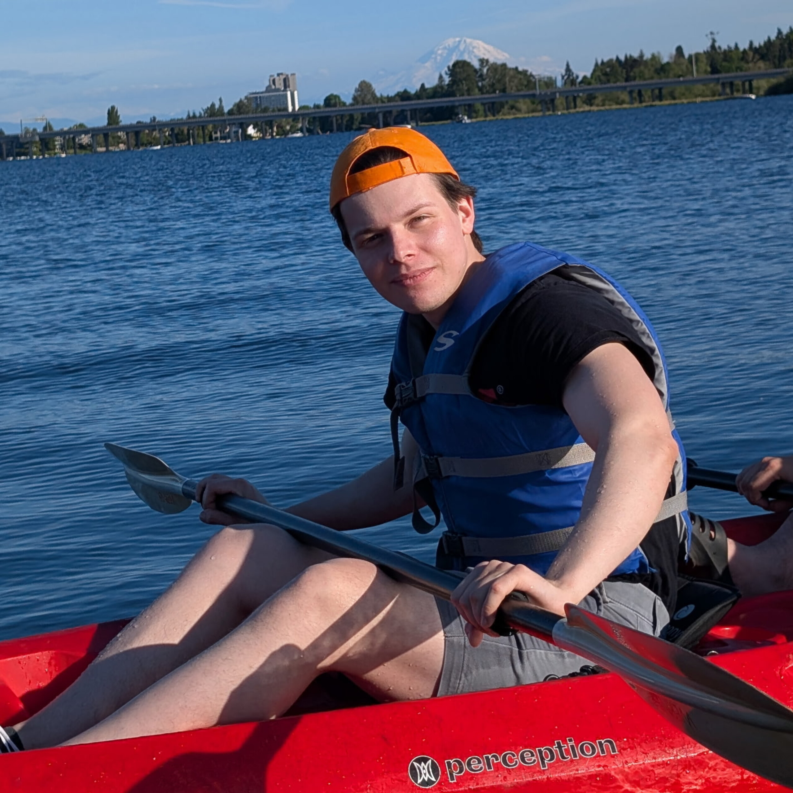

::::: grid
::: {.g-col-12 .g-col-md-4}
{width=200px .d-block .mx-auto}
:::

::: {.g-col-12 .g-col-md-8}
Hi! I post my art and writing into the void.

I'm interested in [Neuro]**philosophy**\*; my degree is in **Economics**.  
[\* - e.g., Dopamine being a prerequisite for *Action*; also *Mind*, *Language*, *Art*.]{.small-text}

I lost 70-80 dB of my hearing when I was 10; sheared my brainstem when I was 24.  
[[My two disabilities](/disabilities/).]{.small-text}

[Shorter writing](/articles/) is about **neurorehabilitation**. I want to help.  
Very relevant for: Long Covid, mild Traumatic Brain Injury / Concussion, Neurodegenerative Diseases, ABIs, Diffuse Axonal Injury.  
SCIs, Strokes, Tumors - less confidence.

::: {style="text-align: right;"}
--- dvp
:::
:::
:::::
