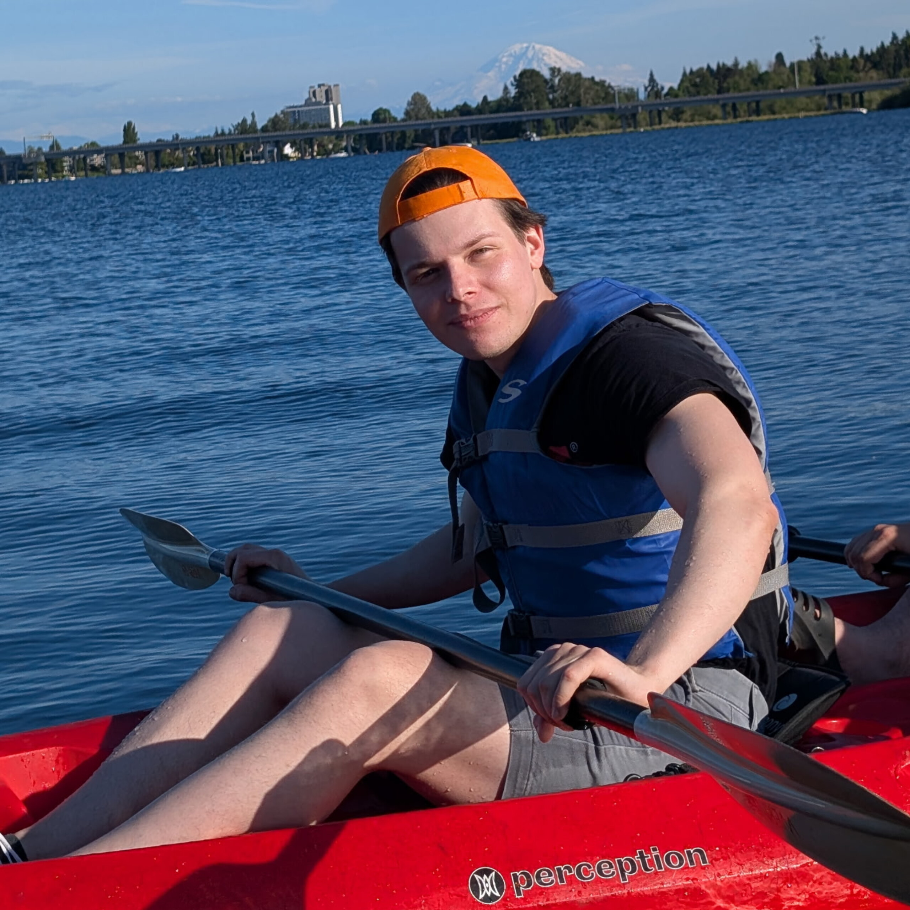

::::: grid
::: {.g-col-12 .g-col-md-4}
{width=200px .d-block .mx-auto}
:::

::: {.g-col-12 .g-col-md-8}
Hi! I post my writing and art into the void.

I'm interested in **Neurophilosophy**\*; my degree is in **Economics**.  
[\* - e.g., Dopamine being a prerequisite for *Action*; also *Mind*, *Language*, *Art*.]{.small-text}

I lost 70-80 dB of my hearing when I was 10; sheared my brainstem when I was 24.

I am a paraeducator for 18-22 y.o.'s at a school district academy.  
[Ten students are active/documented seizure risks.]{.small-text}

[Writing available should be referenced by Long Covid, mTBI, TBI, DAI, MS, PD, other brain conditions.]{.small-text}

::: {style="text-align: right;"}
--- dvp
:::
:::
:::::
